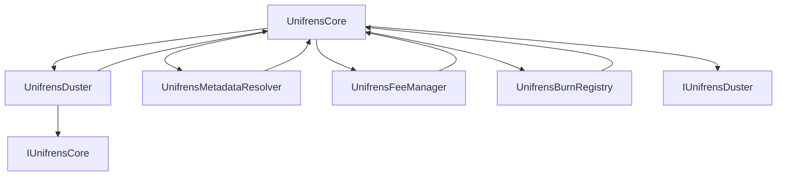
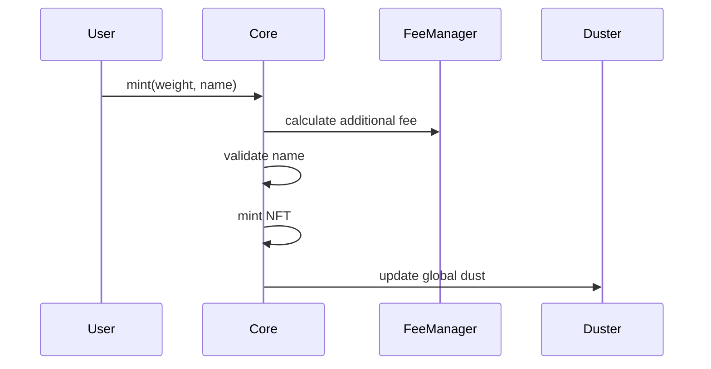
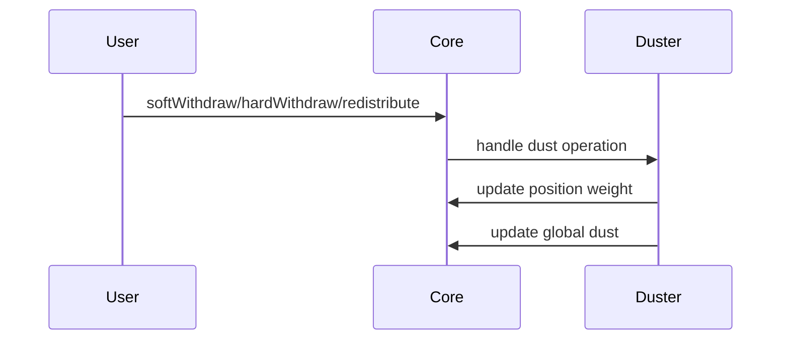
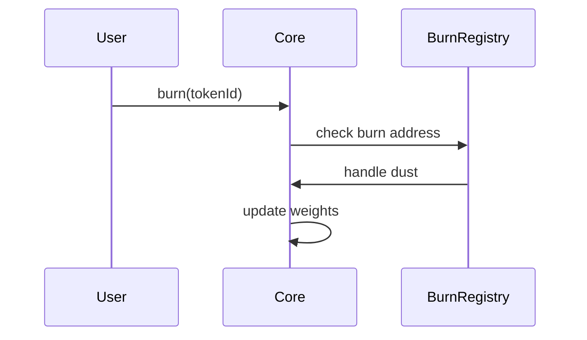
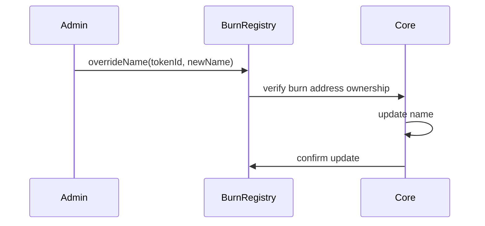

# Unifrens Contract Suite

A modular and upgradeable suite of smart contracts for managing web3 usernames with dust accumulation mechanics.

## Contract Architecture

## Core Components

### UnifrensCore
- Base contract for NFT functionality and name management
- Handles weight storage and basic dust calculations
- Manages minting, transfers, and basic operations
- Interfaces with other components through interfaces
- Implements ERC721Enumerable standard

### UnifrensDuster
- Dust management contract
- Handles dust calculations and distributions
- Manages weight modification logic
- Implements UUPS upgrade pattern
- Interfaces with Core through IUnifrensCore

### UnifrensMetadataResolver
- Metadata management contract
- Handles custom metadata and image generation
- Implements UUPS upgrade pattern

### UnifrensFeeManager
- Fee management contract
- Handles additional fees on top of base minting fee
- Implements UUPS upgrade pattern

### UnifrensBurnRegistry
- Burn address management contract
- Manages list of burn addresses
- Handles dust redistribution for burned tokens
- Provides name override functionality for burned tokens
- Implements UUPS upgrade pattern

### Interface Files
- `IUnifrensCore`: Defines the interface for Core contract functions
- `IUnifrensDuster`: Defines the interface for Duster contract functions

## Contract Interactions

### Minting Flow

### Dust Operations

### Burn Operations

### Name Override Flow

## Deployment Order

### Required Components
1. Deploy `UnifrensCore`
   - This is the only required contract for basic functionality
   - Handles NFT minting, transfers, and basic dust mechanics
   - Implements ERC721Enumerable standard
   - Manages name uniqueness and weight system

### Optional Upgrade Components
These components can be deployed later to add additional functionality:

1. `UnifrensDuster`
   - Handles advanced dust calculations and distributions
   - Requires `IUnifrensCore` interface
   - Implements UUPS upgrade pattern

2. `UnifrensMetadataResolver`
   - Manages custom metadata and image generation
   - No interface dependencies
   - Implements UUPS upgrade pattern

3. `UnifrensFeeManager`
   - Handles additional fees on top of base minting fee
   - No interface dependencies
   - Implements UUPS upgrade pattern

4. `UnifrensBurnRegistry`
   - Manages burn addresses and name overrides
   - No interface dependencies
   - Implements UUPS upgrade pattern

### Interface Deployment
- `IUnifrensCore` and `IUnifrensDuster` are interface files
- No deployment required - they are used for type safety and contract communication
- Must be available during compilation
- Can be updated without redeploying contracts

### Component Setup
After deploying optional components:
1. Set component addresses in Core contract using admin functions
2. Core contract will automatically use components if addresses are set
3. Components can be added or removed at any time
4. Core contract maintains full functionality even without optional components

## Upgrade Process

### Core Contract
- Non-upgradeable
- Requires new deployment for updates
- State migration required

### Other Components
- Each can be upgraded independently
- Uses OpenZeppelin UUPS pattern
- State preserved through proxy
- Upgrade process:
  1. Deploy new implementation
  2. Call upgradeTo() on proxy
  3. Verify new implementation

## State Management

### Core Contract
- Stores NFT state
- Manages name uniqueness
- Tracks weights and dust
- Maintains component references

### Optional Components
- Duster: Manages dust calculations
- MetadataResolver: Handles metadata generation
- FeeManager: Manages additional fees
- BurnRegistry: Manages burn addresses and name overrides

## Security Considerations

1. Access Control
   - Core: Owner-only admin functions
   - Components: Owner-only upgrades
   - Component-specific access modifiers

2. State Protection
   - Core state only modifiable through defined interfaces
   - Component upgrades preserve state
   - Burn registry protects against unauthorized name changes

3. Dust Safety
   - Duster handles all dust calculations
   - Burn registry ensures proper dust redistribution
   - Core maintains weight integrity

## Events

### Core Events
- PositionMinted
- DustClaimed
- PositionBurned
- WeightUpdated
- VictoryClaimed
- Component updates

### Component Events
- Duster: Dust updates
- MetadataResolver: Metadata updates
- FeeManager: Fee updates
- BurnRegistry: Burn address updates, name overrides

## License

MIT License 