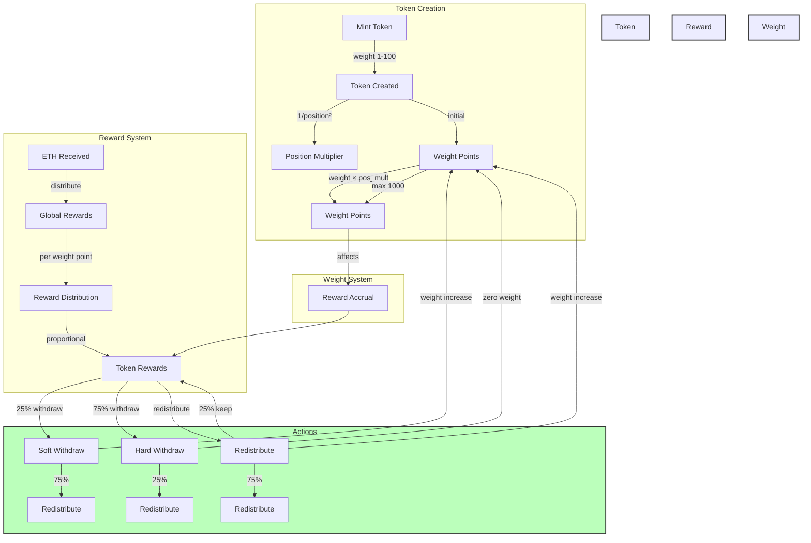

# Unifrens

Unifrens are unique web3 identities that accumulate dust. The protocol has been simplified to focus on core functionality while maintaining extensibility.

## Architecture

### Core Contract (UnifrensCore.sol)
The main contract that handles all core functionality:
- Token minting and management
- Name registration and validation
- Weight-based dust accumulation
- Reward distribution system
- Built-in withdraw mechanisms (soft/hard)

### Optional Components

#### Fee Handler (Optional)
- Manages additional fee collection
- Configurable fee distribution
- Can be added without modifying core contract

#### Unifrens Resolver (Optional)
- Simple interface for third parties
- Resolves names to addresses
- Enables easy integration with other protocols

## Core Mechanics



## Key Features

### 1. Token Management
- ERC721 compliant NFTs
- Unique name system
- Position-based multipliers
- Weight-based mechanics

### 2. Dust Accumulation
- Automatic reward distribution
- Weight-based accumulation rates
- Position multiplier system
- Fair distribution algorithm

### 3. Withdrawal Options
- Soft withdraw (25% claim)
- Hard withdraw (75% claim)
- Redistribute mechanism
- Weight increase system

## Technical Details

### Constants
- MAX_WEIGHT: 1000
- MAX_MINT_WEIGHT: 100
- BASE_WEIGHT_INCREASE: 0.001 ETH
- MIN_SOFT_WITHDRAW: 0.0001 ETH
- MIN_REDISTRIBUTE: 0.00001 ETH

### Core Functions
```solidity
function mint(uint256 weight, string memory name) external payable
function rename(uint256 tokenId, string memory newName) external payable
function softWithdraw(uint256 tokenId) external
function hardWithdraw(uint256 tokenId) external
function redistribute(uint256 tokenId) external
```

## Integration Guide

### Basic Integration
```solidity
interface IUnifrens {
    function getName(string memory name) external view returns (address);
    function getTokenInfo(uint256 tokenId) external view returns (
        uint256 weight,
        uint256 positionMultiplier,
        uint256 pendingRewards,
        uint256 totalClaimed,
        bool isActive
    );
}
```

### Using the Resolver
```solidity
interface IUnifrensResolver {
    function resolveNameToAddress(string memory name) external view returns (address);
    function resolveAddressToNames(address owner) external view returns (string[] memory);
}
```

## Testing

Comprehensive testing documentation available in [TESTING.md](TESTING.md)
- Core functionality tests
- Edge case verification
- Security testing
- Integration testing

## Security

The contract has been simplified to reduce attack surface while maintaining core functionality:
- Minimal external dependencies
- Clear access controls
- Built-in overflow protection
- Standardized validation

## License

MIT License 