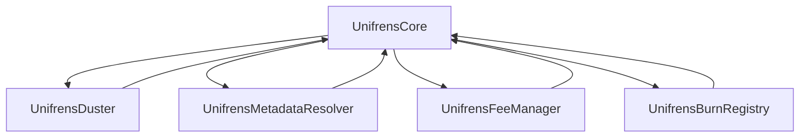
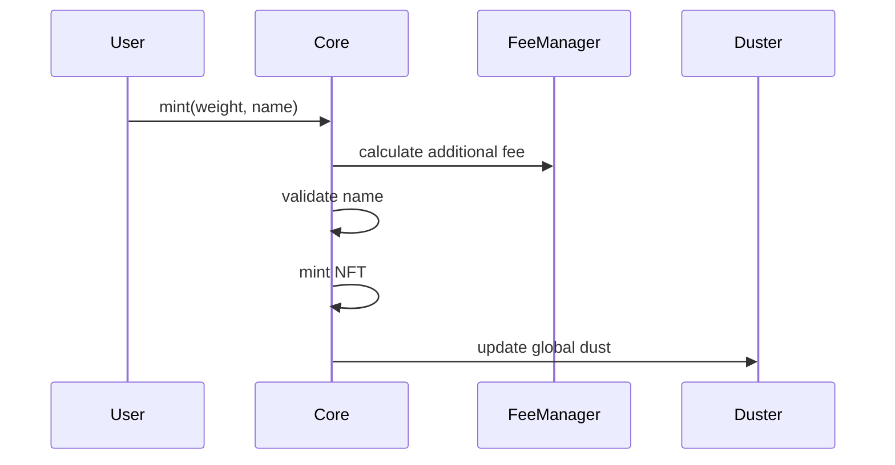
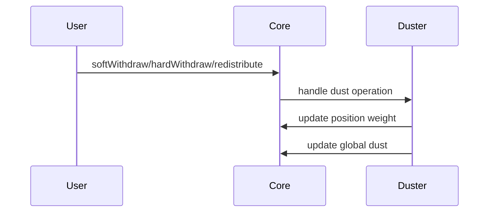
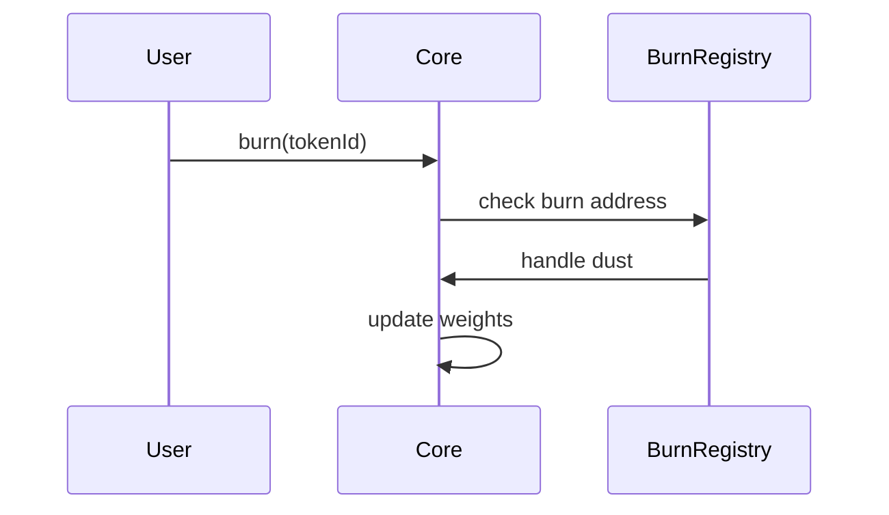
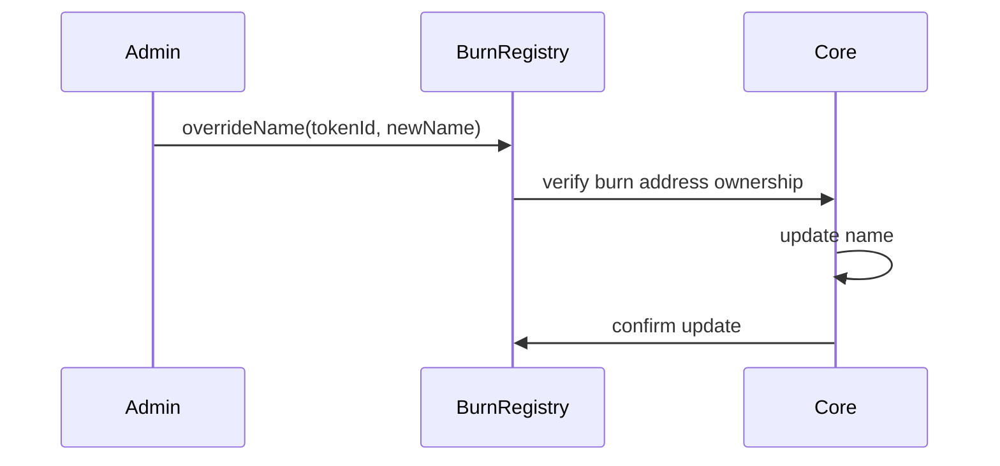

# Unifrens Contract Suite

A modular and upgradeable suite of smart contracts for managing web3 usernames with dust accumulation mechanics.

## Contract Architecture

## Core Components

### UnifrensCore
- Non-upgradeable base contract
- Handles NFT functionality and name management
- Manages weight storage and basic dust calculations
- Interfaces with optional components
- Handles minting, transfers, and basic operations

### UnifrensDuster (Optional)
- Upgradeable dust management contract
- Handles all dust calculations and distributions
- Manages weight modification logic
- Can be upgraded independently
- Implements UUPS upgrade pattern

### UnifrensMetadataResolver (Optional)
- Upgradeable metadata management contract
- Handles custom metadata and image generation
- Can be upgraded independently
- Implements UUPS upgrade pattern

### UnifrensFeeManager (Optional)
- Upgradeable fee management contract
- Handles additional fees on top of base minting fee
- Can be upgraded independently
- Implements UUPS upgrade pattern

### UnifrensBurnRegistry (Optional)
- Upgradeable burn address management contract
- Manages list of burn addresses
- Handles dust redistribution for burned tokens
- Provides name override functionality for burned tokens
- Can be upgraded independently
- Implements UUPS upgrade pattern

## Contract Interactions

### Minting Flow

### Dust Operations

### Burn Operations

### Name Override Flow

## Deployment Order

1. Deploy `UnifrensCore` first (non-upgradeable)
2. Deploy optional components in any order:
   - `UnifrensDuster`
   - `UnifrensMetadataResolver`
   - `UnifrensFeeManager`
   - `UnifrensBurnRegistry`
3. Set component addresses in Core contract

## Upgrade Process

### Core Contract
- Non-upgradeable
- Requires new deployment for updates
- State migration required

### Optional Components
- Each can be upgraded independently
- Uses OpenZeppelin UUPS pattern
- State preserved through proxy
- Upgrade process:
  1. Deploy new implementation
  2. Call upgradeTo() on proxy
  3. Verify new implementation

## State Management

### Core Contract
- Stores NFT state
- Manages name uniqueness
- Tracks weights and dust
- Maintains component references

### Optional Components
- Duster: Manages dust calculations
- MetadataResolver: Handles metadata generation
- FeeManager: Manages additional fees
- BurnRegistry: Manages burn addresses and name overrides

## Security Considerations

1. Access Control
   - Core: Owner-only admin functions
   - Components: Owner-only upgrades
   - Component-specific access modifiers

2. State Protection
   - Core state only modifiable through defined interfaces
   - Component upgrades preserve state
   - Burn registry protects against unauthorized name changes

3. Dust Safety
   - Duster handles all dust calculations
   - Burn registry ensures proper dust redistribution
   - Core maintains weight integrity

## Events

### Core Events
- PositionMinted
- DustClaimed
- PositionBurned
- WeightUpdated
- VictoryClaimed
- Component updates

### Component Events
- Duster: Dust updates
- MetadataResolver: Metadata updates
- FeeManager: Fee updates
- BurnRegistry: Burn address updates, name overrides

## Development

### Prerequisites
- Node.js
- Hardhat
- OpenZeppelin Contracts

### Setup
1. Clone repository
2. Install dependencies: `npm install`
3. Configure environment variables
4. Run tests: `npx hardhat test`

### Testing
- Unit tests for each contract
- Integration tests for contract interactions
- Upgrade tests for optional components

### Deployment
1. Deploy Core contract
2. Deploy optional components
3. Set component addresses in Core
4. Verify contract interactions

## License

MIT License 